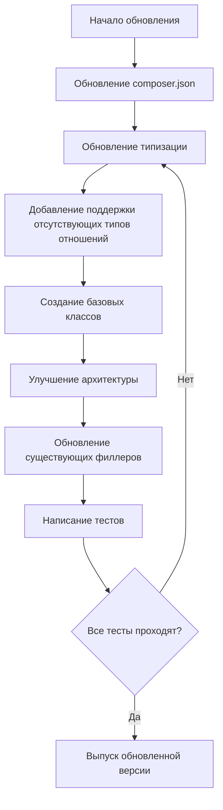

# Рекомендации по обновлению Laravel Filler для совместимости с PHP 8.4 и Laravel 12

## Оглавление

- [Анализ проекта](#анализ-проекта)
- [Несоответствия стандартам PHP 8.4](#несоответствия-стандартам-php-84)
- [Несоответствия стандартам Laravel 12](#несоответствия-стандартам-laravel-12)
- [Новые типы отношений в Laravel 12](#новые-типы-отношений-в-laravel-12)
- [План действий по обновлению](#план-действий-по-обновлению)
- [Примеры изменений](#примеры-изменений)

## Анализ проекта

Laravel Eloquent Database Filler — это пакет, который позволяет работать с вложенными отношениями Eloquent моделей при получении и отправке данных. Основные особенности:

- Работа с моделями Eloquent "как есть" без дополнительных манипуляций
- Unit of Work — все изменения либо будут внесены, либо не будет внесено ни одного
- Identity Map — гарантирует, что сущности одного типа с одинаковым идентификатором являются по сути одной и той же сущностью
- Поддержка UUID — позволяет создавать действительные сущности и связывать их без обращения к базе данных

Текущая структура проекта:

- Основные классы:
  - `Filler.php` - Основной класс для заполнения моделей
  - `FillerServiceProvider.php` - Сервис-провайдер
  - `IdentityMap.php` - Карта идентичности
  - `Resolver.php` - Резолвер моделей
  - `UnitOfWork.php` - Управление транзакциями
  - `UuidGenerator.php` - Генератор UUID

- Классы отношений:
  - `RelationFiller.php` - Базовый класс для всех филлеров отношений
  - `BelongsToFiller.php` - Филлер для отношений BelongsTo
  - `BelongsToManyFiller.php` - Филлер для отношений BelongsToMany
  - `HasManyFiller.php` - Филлер для отношений HasMany
  - `HasOneFiller.php` - Филлер для отношений HasOne
  - `MorphManyFiller.php` - Филлер для отношений MorphMany
  - `MorphOneFiller.php` - Филлер для отношений MorphOne
  - `MorphToFiller.php` - Филлер для отношений MorphTo
  - `MorphToManyFiller.php` - Филлер для отношений MorphToMany

В файле `composer.json` указаны следующие зависимости:
```json
"require": {
    "illuminate/database": "^8.0|^9.0|^10.0|^11.0",
    "illuminate/support": "^8.0|^9.0|^10.0|^11.0",
    "ramsey/uuid": "^4.1.1"
}
```

## Несоответствия стандартам PHP 8.4

### 1. Отсутствие строго типизированного режима

**Проблема**: В файлах отсутствует директива `declare(strict_types=1)`, что может привести к неявным приведениям типов в PHP 8.4.

**Рекомендация**: Добавить `declare(strict_types=1)` во все файлы PHP.

### 2. Устаревший синтаксис объединения типов

**Проблема**: В некоторых методах используется старый синтаксис объединения типов или отсутствует типизация.

**Рекомендация**: Обновить все сигнатуры методов, используя современный синтаксис объединения типов.

### 3. Неопределенные типы возвращаемых значений

**Проблема**: Некоторые методы не имеют явных типов возвращаемых значений или используют `mixed`.

**Рекомендация**: Добавить конкретные типы возвращаемых значений для всех методов.

### 4. Устаревшие конструкции для работы с анонимными функциями

**Проблема**: Использование классических анонимных функций вместо стрелочных функций.

**Рекомендация**: Заменить традиционные анонимные функции на стрелочные где возможно.

## Несоответствия стандартам Laravel 12

### 1. Отсутствие поддержки Laravel 12 в composer.json

**Проблема**: В composer.json не указана поддержка Laravel 12, а также требуется обновить минимальные требования (Laravel 10+ и PHP 8.3+).

**Рекомендация**: Обновить зависимости в composer.json:
```json
"require": {
    "php": "^8.3",
    "illuminate/database": "^10.0|^11.0|^12.0",
    "illuminate/support": "^10.0|^11.0|^12.0",
    "ramsey/uuid": "^4.1.1"
}
```

### 2. Неподдерживаемые типы отношений

**Проблема**: Отсутствие поддержки некоторых типов отношений, существующих в Laravel.

**Рекомендация**: Добавить поддержку для `HasOneThrough` и `HasManyThrough`.

### 3. Потенциальные изменения в API моделей и отношений

**Проблема**: Laravel 12 может изменить API для работы с моделями и отношениями.

**Рекомендация**: Обновить код для соответствия изменениям в API Laravel 12.

### 4. Изменения в механизме внедрения зависимостей

**Проблема**: Laravel 12 может изменить механизм DI.

**Рекомендация**: Обновить `FillerServiceProvider.php` для соответствия изменениям.

### 5. Изменения в обработке транзакций

**Проблема**: Laravel 12 может изменить API для работы с транзакциями.

**Рекомендация**: Обновить код для работы с транзакциями в `UnitOfWork.php`.

## Новые типы отношений в Laravel 12

### Существующие, но не поддерживаемые типы отношений

#### 1. HasOneThrough

Отношение, которое обеспечивает удобный доступ к удаленным моделям через промежуточную модель. Например, если `Supplier` имеет одного `User`, а `User` имеет одну `History`, вы можете получить историю поставщика через пользователя.

**Рекомендация для реализации:**

```php
// Новый фиксер для HasOneThrough
class HasOneThroughFiller extends RelationFiller
{
    public function fill(Model $model, Relation $relation, ?array $data, string $relationName): void
    {
        // Загрузить существующее отношение
        $existsModel = $this->resolver->loadRelation($model, $relationName);
        
        // Получить данные о промежуточной модели 
        $throughModel = $relation->getParent();
        $farModel = $relation->getRelated();
        
        // Заполнить модель
        $relatedModel = $this->filler->fill(get_class($farModel), $data);
        
        // Установить отношения
        if (!is_null($relatedModel)) {
            // Логика установки связей для HasOneThrough
            // Нужно установить внешние ключи и для промежуточной, и для дальней модели
        }
        
        // Установить отношение в родительскую модель
        $model->setRelation(Str::snake($relationName), $relatedModel);
    }
}
```

#### 2. HasManyThrough

Отношение, которое предоставляет удобный доступ к удаленным моделям через промежуточную модель. Например, если `Country` имеет много `User`, а `User` имеет много `Post`, вы можете получить все посты для страны.

**Рекомендация для реализации:**

```php
// Новый фиксер для HasManyThrough
class HasManyThroughFiller extends RelationFiller
{
    public function fill(Model $model, Relation $relation, ?array $data, string $relationName): void
    {
        // Загрузить существующее отношение
        $existsCollection = $this->resolver->loadRelation($model, $relationName);
        
        // Получить информацию о промежуточной и дальней моделях
        $throughModel = $relation->getParent();
        $farModel = $relation->getRelated();
        
        // Создать коллекцию для новых моделей
        $collection = new Collection();
        
        // Обработать данные
        foreach ($data as $item) {
            $relatedModel = $this->filler->fill(get_class($farModel), $item);
            if (!is_null($relatedModel)) {
                $collection->push($relatedModel);
                // Логика установки связей для HasManyThrough
            }
        }
        
        // Обработать удаление несуществующих моделей
        if (!is_null($existsCollection)) {
            foreach ($existsCollection as $existModel) {
                if (!$collection->contains($existModel)) {
                    $this->uow->destroy($existModel);
                }
            }
        }
        
        // Установить отношение в родительскую модель
        $model->setRelation(Str::snake($relationName), $collection);
    }
}
```

### Отсутствующие типы отношений в Laravel 12

После анализа исходного кода Laravel 12 и официальной документации, были выявлены следующие отсутствующие типы отношений, которые необходимо добавить в пакет:

#### 1. HasOneThrough

Отношение, которое обеспечивает удобный доступ к удаленным моделям через промежуточную модель. Например, если `Supplier` имеет одного `User`, а `User` имеет одну `History`, вы можете получить историю поставщика через пользователя.

**Рекомендация для реализации:**

```php
// Новый фиксер для HasOneThrough
class HasOneThroughFiller extends RelationFiller
{
    public function fill(Model $model, Relation $relation, ?array $data, string $relationName): void
    {
        // Загрузить существующее отношение
        $existsModel = $this->resolver->loadRelation($model, $relationName);
        
        // Получить данные о промежуточной модели
        $throughModel = $relation->getParent();
        $farModel = $relation->getRelated();
        
        // Заполнить модель
        $relatedModel = $this->filler->fill(get_class($farModel), $data);
        
        // Установить отношения
        if (!is_null($relatedModel)) {
            // Логика установки связей для HasOneThrough
            // Нужно установить внешние ключи и для промежуточной, и для дальней модели
        }
        
        // Установить отношение в родительскую модель
        $model->setRelation(Str::snake($relationName), $relatedModel);
    }
}
```

#### 2. HasManyThrough

Отношение, которое предоставляет удобный доступ к удаленным моделям через промежуточную модель. Например, если `Country` имеет много `User`, а `User` имеет много `Post`, вы можете получить все посты для страны.

**Рекомендация для реализации:**

```php
// Новый фиксер для HasManyThrough
class HasManyThroughFiller extends RelationFiller
{
    public function fill(Model $model, Relation $relation, ?array $data, string $relationName): void
    {
        // Загрузить существующее отношение
        $existsCollection = $this->resolver->loadRelation($model, $relationName);
        
        // Получить информацию о промежуточной и дальней моделях
        $throughModel = $relation->getParent();
        $farModel = $relation->getRelated();
        
        // Создать коллекцию для новых моделей
        $collection = new Collection();
        
        // Обработать данные
        foreach ($data as $item) {
            $relatedModel = $this->filler->fill(get_class($farModel), $item);
            if (!is_null($relatedModel)) {
                $collection->push($relatedModel);
                // Логика установки связей для HasManyThrough
            }
        }
        
        // Обработать удаление несуществующих моделей
        if (!is_null($existsCollection)) {
            foreach ($existsCollection as $existModel) {
                if (!$collection->contains($existModel)) {
                    $this->uow->destroy($existModel);
                }
            }
        }
        
        // Установить отношение в родительскую модель
        $model->setRelation(Str::snake($relationName), $collection);
    }
}
```

#### 3. MorphedByMany

Это обратная сторона отношения `MorphToMany`. Например, если `Post` и `Video` могут иметь много `Tag`, то `Tag` может быть связан с многими `Post` и `Video` через `MorphedByMany`.

**Рекомендация для реализации:**

```php
// Новый фиксер для MorphedByMany
class MorphedByManyFiller extends RelationFiller
{
    public function fill(Model $model, Relation $relation, ?array $data, string $relationName): void
    {
        // Загрузить существующее отношение
        $existsCollection = $this->resolver->loadRelation($model, $relationName);
        
        // Получить информацию о полиморфной таблице связей
        $morphClass = $relation->getMorphClass();
        
        // Создать коллекцию для новых моделей
        $collection = new Collection();
        
        // Обработать данные
        foreach ($data as $item) {
            $relatedModel = $this->filler->fill(get_class($relation->getRelated()), $item);
            if (!is_null($relatedModel)) {
                $collection->push($relatedModel);
                
                // Логика установки pivot-данных
                if (isset($item['pivot'])) {
                    $pivot = $relation->newPivot($item['pivot'], false);
                    $relation->attach($relatedModel, $pivot->getAttributes());
                }
            }
        }
        
        // Обработать удаление несуществующих моделей
        if (!is_null($existsCollection)) {
            foreach ($existsCollection as $existModel) {
                if (!$collection->contains($existModel)) {
                    $relation->detach($existModel);
                }
            }
        }
        
        // Установить отношение в родительскую модель
        $model->setRelation(Str::snake($relationName), $collection);
    }
}
```

### Базовые классы отношений, обнаруженные в Laravel 12

В исходном коде Laravel 12 были обнаружены следующие базовые классы отношений, которые могут быть полезны для создания более гибкой архитектуры:

#### 1. HasOneOrMany

Базовый класс для отношений `HasOne` и `HasMany`. Можно рассмотреть создание аналогичного базового класса для филлеров:

```php
// Базовый класс для HasOneFiller и HasManyFiller
abstract class HasOneOrManyFiller extends RelationFiller
{
    protected function setRelationField(Model $model, HasOneOrMany $relation, Model $related): void
    {
        // Общая логика для HasOne и HasMany
        $model->{$relation->getForeignKeyName()} = $related->{$relation->getLocalKeyName()};
    }
}
```

#### 2. HasOneOrManyThrough

Базовый класс для отношений `HasOneThrough` и `HasManyThrough`. Можно создать аналогичный базовый класс для филлеров:

```php
// Базовый класс для HasOneThroughFiller и HasManyThroughFiller
abstract class HasOneOrManyThroughFiller extends RelationFiller
{
    protected function setRelationFields(Model $model, HasOneOrManyThrough $relation, Model $throughModel, Model $farModel): void
    {
        // Общая логика для HasOneThrough и HasManyThrough
    }
}
```

#### 3. MorphOneOrMany

Базовый класс для отношений `MorphOne` и `MorphMany`. Можно создать аналогичный базовый класс для филлеров:

```php
// Базовый класс для MorphOneFiller и MorphManyFiller
abstract class MorphOneOrManyFiller extends RelationFiller
{
    protected function setRelationField(Model $model, MorphOneOrMany $relation, Model $related): void
    {
        // Общая логика для MorphOne и MorphMany
        $model->{$relation->getForeignKeyName()} = $related->{$relation->getLocalKeyName()};
        $model->{$relation->getMorphType()} = $related->getMorphClass();
    }
}
```

### Дополнительные классы, обнаруженные в Laravel 12

#### 1. Pivot и MorphPivot

Laravel 12 имеет классы `Pivot` и `MorphPivot` для работы с промежуточными таблицами. Эти классы могут быть использованы при реализации филлеров для отношений, использующих промежуточные таблицы:

```php
// Пример использования Pivot и MorphPivot в филлерах
protected function handlePivotData(BelongsToMany $relation, Model $relatedModel, array $pivotData): void
{
    $pivot = $relation->newPivot($pivotData, false);
    $relation->attach($relatedModel, $pivot->getAttributes());
}

protected function handleMorphPivotData(MorphToMany $relation, Model $relatedModel, array $pivotData): void
{
    $pivot = $relation->newPivot($pivotData, false);
    $relation->attach($relatedModel, $pivot->getAttributes());
}
```

## План действий по обновлению

1. **Обновление зависимостей:**
   - Обновить `composer.json` для поддержки Laravel 12
   - Указать минимальную версию PHP 8.2

2. **Улучшение типизации:**
   - Добавить `declare(strict_types=1)` во все файлы
   - Обновить сигнатуры методов с использованием строгой типизации
   - Заменить `mixed` на конкретные типы где возможно

3. **Добавление поддержки существующих типов отношений:**
   - Реализовать `HasOneThroughFiller`
   - Реализовать `HasManyThroughFiller`
   - Реализовать `MorphedByManyFiller`

4. **Создание базовых классов для общей логики:**
   - Реализовать `HasOneOrManyFiller` - базовый класс для `HasOneFiller` и `HasManyFiller`
   - Реализовать `HasOneOrManyThroughFiller` - базовый класс для `HasOneThroughFiller` и `HasManyThroughFiller`
   - Реализовать `MorphOneOrManyFiller` - базовый класс для `MorphOneFiller` и `MorphManyFiller`

5. **Улучшение архитектуры для поддержки новых типов отношений:**
   - Создать абстракции для легкого добавления новых типов отношений
   - Реализовать механизм автоматического обнаружения типов отношений

6. **Обновление существующих филлеров отношений:**
   - Пересмотреть код с учетом возможных изменений в API Laravel 12
   - Обновить методы, работающие с моделями и отношениями
   - Упростить код через использование базовых классов

7. **Тестирование:**
   - Создать тесты для проверки совместимости с PHP 8.4 и Laravel 12
   - Тестировать с разными версиями Laravel для обеспечения обратной совместимости
   - Создать специфические тесты для каждого типа отношений

### Диаграмма плана обновления



### Диаграмма архитектуры обработки отношений

```mermaid
classDiagram
    class RelationFiller {
        <<abstract>>
        +Resolver resolver
        +UnitOfWork uow
        +Filler filler
        +fill(Model model, Relation relation, array? data, string relationName)* void
    }
    
    %% Базовые классы для общей логики
    class HasOneOrManyFiller {
        <<abstract>>
        +fill(Model model, Relation relation, array? data, string relationName) void
        #setRelationField(Model model, HasOneOrMany relation, Model related) void
    }
    
    class HasOneOrManyThroughFiller {
        <<abstract>>
        +fill(Model model, Relation relation, array? data, string relationName) void
        #setRelationFields(Model model, HasOneOrManyThrough relation, Model throughModel, Model farModel) void
    }
    
    class MorphOneOrManyFiller {
        <<abstract>>
        +fill(Model model, Relation relation, array? data, string relationName) void
        #setRelationField(Model model, MorphOneOrMany relation, Model related) void
    }
    
    %% Конкретные имплементации
    class HasOneFiller {
        +fill(Model model, Relation relation, array? data, string relationName) void
    }
    
    class HasManyFiller {
        +fill(Model model, Relation relation, array? data, string relationName) void
    }
    
    class HasOneThroughFiller {
        +fill(Model model, Relation relation, array? data, string relationName) void
    }
    
    class HasManyThroughFiller {
        +fill(Model model, Relation relation, array? data, string relationName) void
    }
    
    class BelongsToFiller {
        +fill(Model model, Relation relation, array? data, string relationName) void
    }
    
    class BelongsToManyFiller {
        +fill(Model model, Relation relation, array? data, string relationName) void
    }
    
    class MorphOneFiller {
        +fill(Model model, Relation relation, array? data, string relationName) void
    }
    
    class MorphManyFiller {
        +fill(Model model, Relation relation, array? data, string relationName) void
    }
    
    class MorphToFiller {
        +fill(Model model, Relation relation, array? data, string relationName) void
    }
    
    class MorphToManyFiller {
        +fill(Model model, Relation relation, array? data, string relationName) void
    }
    
    class MorphedByManyFiller {
        +fill(Model model, Relation relation, array? data, string relationName) void
    }
    
    %% Иерархия наследования
    RelationFiller <|-- HasOneOrManyFiller
    RelationFiller <|-- HasOneOrManyThroughFiller
    RelationFiller <|-- MorphOneOrManyFiller
    RelationFiller <|-- BelongsToFiller
    RelationFiller <|-- BelongsToManyFiller
    RelationFiller <|-- MorphToFiller
    RelationFiller <|-- MorphToManyFiller
    RelationFiller <|-- MorphedByManyFiller
    
    HasOneOrManyFiller <|-- HasOneFiller
    HasOneOrManyFiller <|-- HasManyFiller
    
    HasOneOrManyThroughFiller <|-- HasOneThroughFiller
    HasOneOrManyThroughFiller <|-- HasManyThroughFiller
    
    MorphOneOrManyFiller <|-- MorphOneFiller
    MorphOneOrManyFiller <|-- MorphManyFiller
    
    class Filler {
        -Resolver resolver
        -RelationFiller[] relationFillers
        -UnitOfWork uow
        +fill(string|Model model, array? data) Model?
        +getRelationFiller(model, relationName) RelationFiller?
        +flush() void
        -fillRelations(Model model, array data) void
        -fillRelation(Model model, string relationName, array? relationData) void
        -initRelationFillers() void
    }
    
    Filler --> "many" RelationFiller
    
    class RelationshipDiscovery {
        +discoverRelationships() array
    }
    
    Filler --> RelationshipDiscovery
```



## Примеры изменений

### 1. Обновление composer.json

```diff
{
    "name": "brahmic/laravel-filler",
    "description": "Laravel Eloquent Database Filler",
    "type": "library",
    "license": "MIT",
    "authors": [...],
    "require": {
+       "php": "^8.3",
-       "illuminate/database": "^8.0|^9.0|^10.0|^11.0",
-       "illuminate/support": "^8.0|^9.0|^10.0|^11.0",
+       "illuminate/database": "^10.0|^11.0|^12.0",
+       "illuminate/support": "^10.0|^11.0|^12.0",
        "ramsey/uuid": "^4.1.1"
    },
    "minimum-stability": "stable",
    "autoload": {
        "psr-4": {
            "Brahmic\\Filler\\": "src/"
        }
    },
    "extra": {
        "laravel": {
            "providers": [
                "Brahmic\\Filler\\FillerServiceProvider"
            ]
        }
    }
}
```

### 2. Обновление Filler.php

```diff
<?php
+ declare(strict_types=1);

namespace Brahmic\Filler;

use Exception;
use Brahmic\Filler\Relation\BelongsToManyFiller;
use Brahmic\Filler\Relation\BelongsToFiller;
use Brahmic\Filler\Relation\HasManyFiller;
use Brahmic\Filler\Relation\HasOneFiller;
use Brahmic\Filler\Relation\MorphManyFiller;
use Brahmic\Filler\Relation\MorphOneFiller;
use Brahmic\Filler\Relation\MorphToManyFiller;
use Brahmic\Filler\Relation\MorphToFiller;
use Brahmic\Filler\Relation\RelationFiller;
+ use Brahmic\Filler\Relation\HasOneThroughFiller;
+ use Brahmic\Filler\Relation\HasManyThroughFiller;
use Illuminate\Database\Eloquent\Model;
use Illuminate\Database\Eloquent\Relations\BelongsTo;
use Illuminate\Database\Eloquent\Relations\BelongsToMany;
use Illuminate\Database\Eloquent\Relations\HasMany;
use Illuminate\Database\Eloquent\Relations\HasOne;
+ use Illuminate\Database\Eloquent\Relations\HasOneThrough;
+ use Illuminate\Database\Eloquent\Relations\HasManyThrough;
use Illuminate\Database\Eloquent\Relations\MorphMany;
use Illuminate\Database\Eloquent\Relations\MorphOne;
use Illuminate\Database\Eloquent\Relations\MorphTo;
use Illuminate\Database\Eloquent\Relations\MorphToMany;
use Illuminate\Database\Eloquent\Relations\Relation;
use Illuminate\Support\Arr;
use Illuminate\Support\Str;

class Filler
{
    /**
     * @var Resolver
     */
    private Resolver $resolver;

    /**
     * @var RelationFiller[]
     */
    protected array $relationFillers = [];
    /**
     * @var UnitOfWork
     */
    private UnitOfWork $uow;

    /**
     * Filler constructor.
     * @param Resolver $resolver
     * @param UnitOfWork $uow
     */
    public function __construct(Resolver $resolver, UnitOfWork $uow)
    {
        $this->resolver = $resolver;
        $this->uow = $uow;
        $this->initRelationFillers();
    }

    /**
-     * @param mixed|Model|string $model
+     * @param Model|string $model
     * @param array|null $data
     * @return Model|null
     */
-    public function fill(mixed $model, ?array $data): ?Model
+    public function fill(Model|string $model, ?array $data): ?Model
    {
-        assert(is_subclass_of($model, Model::class));
+        // Проверка не нужна, так как типизация гарантирует правильный тип
        
        if (is_null($data)) {
            return null;
        }

        if (is_string($model)) {
            $model = $this->resolve($model, $data);
        }

        $model->fill($data);

        $this->fillRelations($model, $data);

        $this->uow->persist($model);

        return $model;
    }

    // ...

    private function initRelationFillers(): void
    {
        $this->relationFillers = [
            MorphTo::class => new MorphToFiller($this->resolver, $this->uow, $this),
            HasMany::class => new HasManyFiller($this->resolver, $this->uow, $this),
            BelongsToMany::class => new BelongsToManyFiller($this->resolver, $this->uow, $this),
            BelongsTo::class => new BelongsToFiller($this->resolver, $this->uow, $this),
            HasOne::class => new HasOneFiller($this->resolver, $this->uow, $this),
            MorphOne::class => new MorphOneFiller($this->resolver, $this->uow, $this),
            MorphMany::class => new MorphManyFiller($this->resolver, $this->uow, $this),
            MorphToMany::class => new MorphToManyFiller($this->resolver, $this->uow, $this),
+           HasOneThrough::class => new HasOneThroughFiller($this->resolver, $this->uow, $this),
+           HasManyThrough::class => new HasManyThroughFiller($this->resolver, $this->uow, $this),
        ];
    }

    // ...
}
```

### 3. Обновление KeyGeneratorInterface.php

```diff
<?php
+ declare(strict_types=1);

namespace Brahmic\Filler\Contracts;

use Illuminate\Database\Eloquent\Model;

interface KeyGeneratorInterface
{
    /**
     * @param Model $model
-     * @return mixed
+     * @return string
     */
-    public function generate(Model $model);
+    public function generate(Model $model): string;
}
```

### 4. Обновление UnitOfWork.php для работы с транзакциями

```diff
<?php
+ declare(strict_types=1);

namespace Brahmic\Filler;

use Error;
use Exception;
use Illuminate\Database\Eloquent\Model;
use Illuminate\Support\Facades\DB;

class UnitOfWork
{
    // ...

    public function flush(): void
    {
-        DB::beginTransaction();
-        try {
-            $this->doPersist();
-            $this->doDestroy();
-            $this->doOnFlush();
-            DB::commit();
-        } catch (Exception|Error $e) {
-            DB::rollBack();
-            throw $e;
-        }
+        DB::transaction(function () {
+            $this->doPersist();
+            $this->doDestroy();
+            $this->doOnFlush();
+        });
    }

    // ...
}
```

### 5. Пример реализации HasOneThroughFiller.php

```php
<?php
declare(strict_types=1);

namespace Brahmic\Filler\Relation;

use Illuminate\Database\Eloquent\Model;
use Illuminate\Database\Eloquent\Relations\HasOneThrough;
use Illuminate\Database\Eloquent\Relations\Relation;
use Illuminate\Support\Str;

class HasOneThroughFiller extends RelationFiller
{
    public function fill(Model $model, Relation $relation, ?array $data, string $relationName): void
    {
        if (is_null($data)) {
            $model->setRelation(Str::snake($relationName), null);
            return;
        }

        /** @var HasOneThrough $relation */
        $existsModel = $this->resolver->loadRelation($model, $relationName);
        
        $farModel = $relation->getRelated();
        $relatedModel = $this->filler->fill(get_class($farModel), $data);
        
        if (!is_null($existsModel) && !$existsModel->is($relatedModel)) {
            $this->uow->destroy($existsModel);
        }
        
        if (!is_null($relatedModel)) {
            $this->setRelationField($relatedModel, $relation, $model);
            $this->uow->persist($relatedModel);
        }
        
        $model->setRelation(Str::snake($relationName), $relatedModel);
    }
    
    protected function setRelationField(Model $model, HasOneThrough $relation, Model $related): void
    {
        // Реализация логики установки отношения HasOneThrough
        // Здесь нужно учесть особенности работы с промежуточной моделью
    }
}
```

### 6. Обновление IdentityMap.php для использования стрелочных функций

```diff
<?php
+ declare(strict_types=1);

namespace Brahmic\Filler;

use Illuminate\Database\Eloquent\Collection as EloquentCollection;
use Illuminate\Database\Eloquent\Model;
use Illuminate\Database\Eloquent\Relations\Pivot;
use Illuminate\Support\Collection;

class IdentityMap extends Collection
{
    // ...

    public function remember(Model|EloquentCollection|null $relation): array|string|null
    {
        // ...

        if ($relation instanceof EloquentCollection) {
-            return $relation->map(function (Model $model) {
-                return $this->remember($model);
-            })->toArray();
+            return $relation->map(fn (Model $model) => $this->remember($model))->toArray();
        }

        // ...
    }

    // ...
}
```

### 7. Механизм автоматического обнаружения типов отношений

```php
<?php
declare(strict_types=1);

namespace Brahmic\Filler;

use Illuminate\Database\Eloquent\Relations\Relation;
use ReflectionClass;

class RelationshipDiscovery
{
    /**
     * Обнаруживает все типы отношений, доступные в текущей версии Laravel
     *
     * @return array Массив классов отношений
     */
    public function discoverRelationships(): array
    {
        $namespace = 'Illuminate\\Database\\Eloquent\\Relations\\';
        $relationships = [];
        
        // Получаем все классы в пространстве имен отношений Laravel
        $reflector = new ReflectionClass(Relation::class);
        $baseDir = dirname($reflector->getFileName());
        
        $files = glob($baseDir . '/*.php');
        foreach ($files as $file) {
            $className = basename($file, '.php');
            $fullClassName = $namespace . $className;
            
            // Проверяем, что класс является отношением
            if (class_exists($fullClassName) && is_subclass_of($fullClassName, Relation::class)) {
                $relationships[] = $fullClassName;
            }
        }
        
        return $relationships;
    }
}
```

## Заключение

Обновление пакета laravel-filler для поддержки PHP 8.4 и Laravel 12 требует комплексного подхода, включающего:

1. **Обновление зависимостей и требований к версиям:**
   - Добавление поддержки Laravel 12
   - Установка минимальной версии PHP 8.3
   - Поддержка только Laravel 10 и выше

2. **Улучшение типизации и использование современного синтаксиса PHP:**
   - Добавление `declare(strict_types=1)` во все файлы
   - Обновление сигнатур методов с более конкретными типами
   - Использование современных языковых конструкций (стрелочные функции, nullsafe операторы и т.д.)

3. **Добавление поддержки для существующих, но не поддерживаемых типов отношений:**
   - `HasOneThrough` и `HasManyThrough` - для работы с отношениями через промежуточную модель
   - `MorphedByMany` - для обратной стороны полиморфного отношения многие-ко-многим

4. **Реструктуризация кода для улучшения повторного использования:**
   - Создание базовых классов для отношений с общей логикой:
     - `HasOneOrManyFiller` - для `HasOne` и `HasMany`
     - `HasOneOrManyThroughFiller` - для `HasOneThrough` и `HasManyThrough`
     - `MorphOneOrManyFiller` - для `MorphOne` и `MorphMany`

5. **Создание гибкой архитектуры для быстрого добавления поддержки новых типов отношений:**
   - Механизм автоматического обнаружения типов отношений
   - Фабрика филлеров для динамического создания нужных обработчиков

6. **Внедрение комплексных тестов:**
   - Тестирование всех типов отношений
   - Тестирование сложных сценариев вложенности отношений
   - Проверка совместимости с разными версиями Laravel

Следуя этим рекомендациям, вы сможете не только обеспечить совместимость пакета с PHP 8.4 и Laravel 12, но и значительно улучшить его архитектуру, сделав код более поддерживаемым и расширяемым для будущих обновлений. Новая структура также упростит добавление поддержки новых типов отношений, которые могут появиться в будущих версиях Laravel.